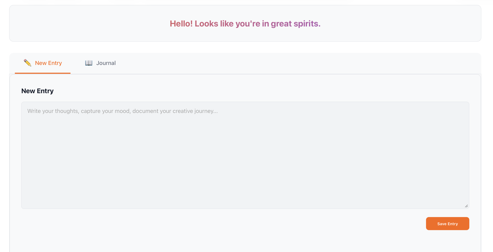
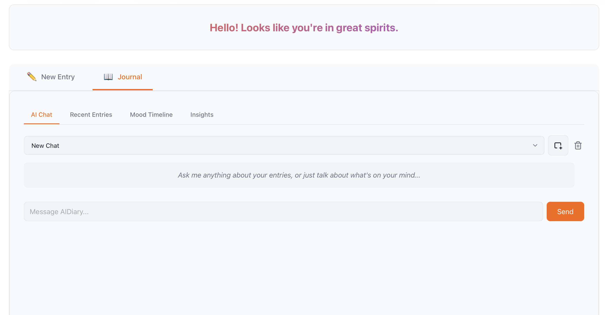

# AIDiary 

**Your Private, Local Creative Companion.**
*Zero Surveillance. Zero Tracking. 100% Local AI.*

AIDiary is more than just a place to write, it's an intelligent vault for your thoughts. Powered by local LLMs and advanced pattern recognition, it turns your daily entries into deep insights about your mood, creativity, and life patterns—all without a single byte of data leaving your machine.

<div align="center">
  
  <br/><br/>
  
</div>

---

##  Uncompromising Privacy

I built AIDiary because your thoughts belong to you, and only you.

- **Local Storage**: Your data lives on your machine in a local SQLite database. You own the file, you control the access.
- **100% Local Processing**: All AI analysis, vector embeddings, and chat features run locally on your CPU using `llama.cpp` and `SentenceTransformers`.
- **Offline First**: Works completely offline. Pull the plug and it works just the same.

##  Key Features

- **100% Local Intelligence**: Powered by `llama.cpp` and `SentenceTransformers`, running entirely on your CPU for maximum privacy without key-logging or data leakage.
- **Temporal Intelligence Engine**: Analyzes your journal entries to detect hidden mood cycles (e.g., "Monday anxiety"), productivity trends, and emotional triggers over weeks and months.
- **Semantic RAG System**: Uses ChromaDB and vector embeddings to let you "chat with your past," retrieving contextually relevant memories based on meaning, not just keywords.
- **Automatic Pattern Recognition**: A background agent extracts entities to identify projects, movies watched, books read, and recurring activities without manual tagging.
- **Context-Aware Recommender**: Generates personalized greetings and suggestions (wellness, creative prompts) tailored to your real-time emotional state and time of day.
- **Privacy-First Architecture**: Built on a local SQLite database with zero telemetry, ensuring your personal thoughts remain offline and under your control.

---

##  Quick Start

### Option 1: Docker (Recommended)

The easiest way to run AIDiary with all dependencies bundled.

```bash
# 1. Download a GGUF model (e.g., Llama-3-8B-Quantized) to the models/ directory
# 2. Run with Docker Compose
docker-compose up -d

# 3. Open http://localhost:8000
```

### Option 2: Manual Installation

**Prerequisites:** Python 3.10+, C++ Build Tools (for llama-cpp-python).

1.  **Install Dependencies:**
    ```bash
    pip install -r requirements.txt
    ```
2.  **Get a Model:**
    Download any `.gguf` model (1B-7B recommended for CPU) and place it in the `models/` folder.
3.  **Run:**
    *   **Windows:** `start.bat`
    *   **Mac/Linux:** `./start.sh`
4.  **Access:**
    Open `http://localhost:8000` in your browser.

---

##  Tech Stack

Built for transparency and performance.

- **Backend:** FastAPI, Python 3.11
- **Database:** SQLite
- **AI Inference:** `llama-cpp-python` (GGUF support)
- **Vector DB:** ChromaDB (Local persistence)
- **Frontend:** Vanilla JS, CSS Variables (No build step required)

---
